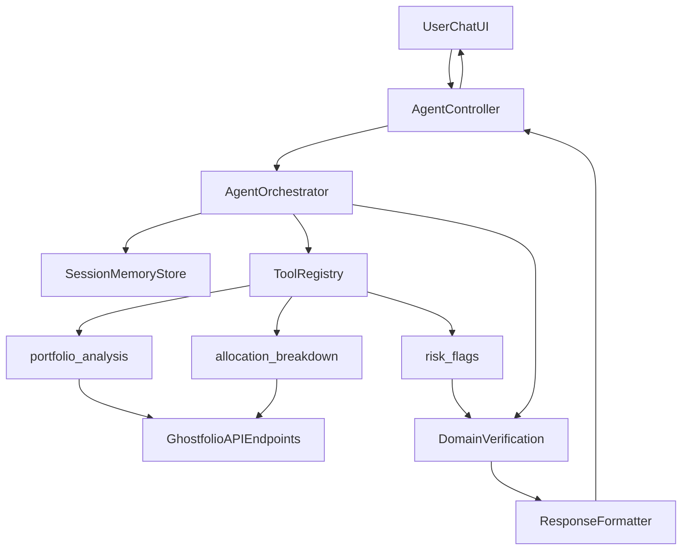

# Ghostfolio Finance Agent: Architecture and 2h MVP Execution Plan

## 1) Executive Architecture (Full-App Ready, MVP First)

This architecture is designed so the 2-hour MVP is a strict subset of the full production system. The MVP can ship with minimal components, while all boundaries remain stable for Day 4 and Day 7 expansion.

### Core Components

1. **Reasoning Engine**
   - Existing Ghostfolio AI provider path (`AiService` + OpenRouter model property).
   - MVP: intent routing + response synthesis prompting.
   - Full: structured planning output, deterministic tool selection policy.

2. **Tool Registry + Schemas**
   - Each tool defined by `name`, `inputSchema`, `outputSchema`, `execute()`.
   - MVP: 3 tools (`portfolio_analysis`, `allocation_breakdown`, `risk_flags`).
   - Full: add `market_context`, `transaction_pattern_analysis`, `performance_diagnostics`, `compliance_guard`.

3. **Memory / State**
   - MVP: in-memory per-session ring buffer.
   - Full: Redis-backed session store + retention policy + user/session indexing.

4. **Orchestrator**
   - Receives chat request, resolves intent, picks tool chain, executes tools, retries failed tool once, aggregates outputs, calls verification, formats response.
   - Stable interface from MVP onward.

5. **Verification Layer**
   - MVP: finance-specific concentration checks (asset + sector thresholds).
   - Full: add hallucination guard, claim grounding, confidence scoring, output schema strict validation, escalation triggers.

6. **Output Formatter**
   - Standard response envelope with answer, citations, confidence, warnings, traceId, timings, tool run summary.
   - Keeps API contract stable across all milestones.

### End-to-End Data and Control Flow



### Why This Is Extensible

- Tool contracts isolate data access from orchestration logic.
- Verification runs on structured tool outputs, so additional checks are additive.
- Memory interface is pluggable (in-memory now, Redis later).
- Response contract already includes observability and verification metadata to avoid future API breaks.

---

## 2) MVP Architecture Slice (2-Hour Boundary)

### Integration Target

- API module path: `apps/api/src/app/endpoints/ai/` (reuse existing auth/permission patterns).
- New internal feature root for maintainability:
  - `apps/api/src/app/gauntlet-ai/` for orchestrator, tools, contracts, verification, memory.

### MVP Feature Boundaries

1. Single chat endpoint under AI namespace.
2. Three functional tools with schema-validated outputs.
3. In-memory session history.
4. Domain verification (asset + sector concentration).
5. Graceful error handling + one retry (300ms backoff).
6. CLI + Jest MVP evaluations (5 tests).
7. Minimal UI chat panel for manual validation.

### Non-Goals in MVP

- Full multi-tool planner loops and recursive planning.
- Persistent memory storage.
- Full observability dashboards.
- 50-test full eval suite.

---

## 3) Tool Contracts (MVP) and Endpoint Adapter Strategy

Tool execution approach: **endpoint adapters** that call existing Ghostfolio API-compatible data paths, preserving ability to swap data source implementation later.

### 3.1 `portfolio_analysis` (MVP)

**Purpose**
- Return top-level portfolio snapshot and concentration summary.

**Input Schema**

```json
{
  "type": "object",
  "properties": {
    "sessionId": { "type": "string" },
    "filters": { "type": "object" }
  },
  "required": ["sessionId"]
}
```

**Output Schema**

```json
{
  "type": "object",
  "properties": {
    "totalValue": { "type": "number" },
    "baseCurrency": { "type": "string" },
    "topHoldings": {
      "type": "array",
      "items": {
        "type": "object",
        "properties": {
          "symbol": { "type": "string" },
          "name": { "type": "string" },
          "allocationPct": { "type": "number" }
        },
        "required": ["symbol", "allocationPct"]
      }
    }
  },
  "required": ["topHoldings"]
}
```

**Source**
- Ghostfolio portfolio API/domain endpoints used in current AI and portfolio flow.

**Failure Modes**
- Upstream timeout, auth error, empty portfolio, malformed payload.

**Retry**
- 1 retry after 300ms for transient network/5xx only.

**Security**
- Must run in current user scope, never accept foreign userId from payload.

### 3.2 `allocation_breakdown` (MVP)

**Purpose**
- Return allocation by asset and sector (as selected).

**Input Schema**

```json
{
  "type": "object",
  "properties": {
    "sessionId": { "type": "string" },
    "groupBy": {
      "type": "array",
      "items": { "enum": ["asset", "sector"] }
    }
  },
  "required": ["sessionId"]
}
```

**Output Schema**

```json
{
  "type": "object",
  "properties": {
    "assetAllocations": {
      "type": "array",
      "items": {
        "type": "object",
        "properties": {
          "symbol": { "type": "string" },
          "allocationPct": { "type": "number" }
        },
        "required": ["allocationPct"]
      }
    },
    "sectorAllocations": {
      "type": "array",
      "items": {
        "type": "object",
        "properties": {
          "sector": { "type": "string" },
          "allocationPct": { "type": "number" }
        },
        "required": ["sector", "allocationPct"]
      }
    }
  }
}
```

**Source**
- Holdings/allocation payloads already used in AI and portfolio details paths.

**Failure Modes**
- Missing sector metadata, empty holdings list.

**Retry**
- Same policy.

**Security**
- Never expose raw PII in tool output; finance values only.

### 3.3 `risk_flags` (MVP)

**Purpose**
- Apply deterministic concentration risk checks.

**Input Schema**

```json
{
  "type": "object",
  "properties": {
    "assetAllocations": { "type": "array" },
    "sectorAllocations": { "type": "array" },
    "assetThresholdPct": { "type": "number", "default": 25 },
    "sectorThresholdPct": { "type": "number", "default": 40 }
  },
  "required": ["assetAllocations", "sectorAllocations"]
}
```

**Output Schema**

```json
{
  "type": "object",
  "properties": {
    "flags": {
      "type": "array",
      "items": {
        "type": "object",
        "properties": {
          "type": { "enum": ["ASSET_CONCENTRATION", "SECTOR_CONCENTRATION"] },
          "severity": { "enum": ["low", "medium", "high"] },
          "message": { "type": "string" },
          "evidence": { "type": "object" }
        },
        "required": ["type", "severity", "message"]
      }
    }
  },
  "required": ["flags"]
}
```

**Source**
- Derived from `allocation_breakdown` output.

**Failure Modes**
- Input schema mismatch.

**Retry**
- No retry (deterministic local logic).

**Security**
- Deterministic rule execution, no model-generated risk claims.

---

## 4) Domain Verification Contract (MVP)

### Rules

1. **Asset concentration**
   - If any asset allocation > 25%, emit risk warning.
2. **Sector concentration**
   - If any sector allocation > 40%, emit risk warning.

### Trigger

- Run after tool aggregation, before final answer formatting.

### Pass / Fail Behavior

- **Pass**: no warnings, confidence unaffected.
- **Warn**: include risk warnings, lower confidence by one band.
- **Fail**: if allocation data missing for requested risk query, return guarded response with `insufficient_data` warning.

### Escalation Path (MVP)

- Add `needsHumanReview: true` if:
  - confidence is low and user asks direct recommendation question, or
  - tool execution fails and critical allocation data unavailable.

### Latency Impact

- Near-zero (<10ms, deterministic computation).

---

## 5) Error Handling and Retry Matrix (MVP)

| Stage | Failure Type | Handling | Retry |
|---|---|---|---|
| Tool adapter call | 5xx / timeout | log + transient failure tag | 1 retry, 300ms |
| Tool adapter call | 4xx/auth | fail fast, no retry | none |
| Schema parse | invalid output | convert to structured tool error | none |
| Verification | missing required fields | guarded response with warning | none |
| LLM synth | provider error | fallback templated response using tool data only | none |

Fallback response must never crash endpoint and must include:
- `warnings[]`
- `toolErrors[]`
- partial data if available

---

## 6) Evaluation Plan (MVP Now, Full Later)

### MVP (within 2h plan)

- **CLI runner**: runs JSON test cases and prints pass/fail summary.
- **Jest suite**: 5 deterministic tests.

Suggested distribution:
- 3 happy path
- 1 edge case (missing sector data)
- 1 adversarial prompt (direct investment advice wording)

### Full Expansion Path

- Move to 50-case dataset:
  - 20 happy
  - 10 edge
  - 10 adversarial
  - 10 multi-step
- Add tool selection accuracy and hallucination metrics.
- Gate CI merges by minimum pass thresholds.

---

## 7) Observability: MVP Minimum and Upgrade Path

### MVP Minimum

- Structured JSON logs per request with:
  - `traceId`
  - `sessionId`
  - `userId` (hashed or internal id)
  - tool calls and durations
  - total latency
  - verification result
  - error category

### Day 4 Upgrade

- Persist request traces and eval runs.
- Add token usage and cost estimates.
- Add dashboard for:
  - p50/p95 latency
  - tool success rate
  - verification flag rate

### Day 7 Upgrade

- Regression alerts on eval score drops.
- Feedback telemetry (thumbs up/down + correction reason).

---

## 8) Two-Hour MVP Runbook (Minute-by-Minute)

## 0-15 min
- Scaffold `apps/api/src/app/gauntlet-ai/` module boundaries:
  - `contracts/`
  - `orchestrator/`
  - `tools/`
  - `verification/`
  - `memory/`
- Add chat DTO + response DTO contract.

## 15-35 min
- Implement tool registry + 3 tool interfaces.
- Build endpoint adapters for:
  - portfolio snapshot
  - allocation breakdown (asset + sector)
- Add output schema validation guards.

## 35-50 min
- Implement `risk_flags` deterministic rule engine.
- Add verification hook in orchestrator.

## 50-70 min
- Build orchestrator flow:
  - intent mapping
  - tool selection
  - execution with retry
  - aggregate + verify
  - synthesize final response
- Add in-memory session history (last N turns).

## 70-85 min
- Wire controller route in AI endpoint family.
- Ensure auth/permission behavior mirrors existing AI controller style.
- Add graceful fallback paths.

## 85-100 min
- Add 5 Jest tests (contract + verification + fallback).
- Add small CLI eval runner with same test fixtures.

## 100-115 min
- Minimal UI chat panel wiring (basic input/output + sessionId).
- Manual smoke test: one normal query, one risk query, one failure path.

## 115-120 min
- Prepare Railway env vars and deploy checklist.
- Confirm endpoint reachable publicly.

---

## 9) Repository Structure Proposal

```text
Gauntlet AI/
  doc/
    G4 Week 2 - AgentForge.pdf
    PRD - Ghostfolio Finance Agent.md
    Ghostfolio Finance Agent - Architecture and 2h MVP Plan.md

apps/
  api/
    src/
      app/
        gauntlet-ai/
          contracts/
            agent-request.schema.ts
            agent-response.schema.ts
            tool-contracts.ts
          memory/
            in-memory-session.store.ts
          orchestrator/
            agent-orchestrator.service.ts
            tool-execution.service.ts
          tools/
            tool-registry.ts
            portfolio-analysis.tool.ts
            allocation-breakdown.tool.ts
            risk-flags.tool.ts
            adapters/
              portfolio-endpoint.adapter.ts
              allocation-endpoint.adapter.ts
          verification/
            concentration-risk.verifier.ts
            verification.types.ts
        endpoints/
          ai/
            ai.controller.ts
            ai.module.ts
            ai.service.ts
            agent-chat.controller.ts
            agent-chat.service.ts

eval/
  datasets/
    mvp-tests.json
  runners/
    run-mvp-evals.ts
  reports/
    .gitkeep

observability/
  logging/
    trace-log.schema.json
  metrics/
    mvp-metrics.md
```

---

## 10) API Contracts (MVP Stable Envelope)

### Agent Request

```json
{
  "sessionId": "string",
  "message": "string",
  "filters": {
    "accounts": ["string"],
    "assetClasses": ["string"],
    "symbols": ["string"],
    "tags": ["string"]
  },
  "options": {
    "includeDiagnostics": true
  }
}
```

### Tool Call Envelope

```json
{
  "traceId": "string",
  "toolName": "portfolio_analysis",
  "input": {},
  "attempt": 1,
  "startedAt": "ISO-8601",
  "durationMs": 120,
  "status": "success",
  "error": null,
  "output": {}
}
```

### Verification Report

```json
{
  "status": "pass",
  "confidence": "medium",
  "needsHumanReview": false,
  "warnings": [
    "Sector concentration exceeds 40% in Technology (45.2%)."
  ],
  "checks": [
    {
      "name": "asset_concentration_check",
      "status": "pass",
      "evidence": []
    },
    {
      "name": "sector_concentration_check",
      "status": "warn",
      "evidence": [
        { "sector": "Technology", "allocationPct": 45.2 }
      ]
    }
  ]
}
```

### Final Agent Response

```json
{
  "answer": "string",
  "confidence": "low",
  "warnings": ["string"],
  "citations": [
    {
      "tool": "allocation_breakdown",
      "keys": ["sectorAllocations[0].allocationPct"]
    }
  ],
  "traceId": "string",
  "latencyMs": 843,
  "toolRuns": [
    {
      "toolName": "portfolio_analysis",
      "status": "success",
      "durationMs": 116
    }
  ],
  "needsHumanReview": false
}
```

---

## 11) Development Plan Beyond 2 Hours (No Rewrite Path)

### Day 1 (after MVP)

- Add 2+ tools to reach 5 minimum.
- Add explicit hallucination guard check.
- Expand eval cases to 15-20.

### Day 2-4

- Implement persistent eval reports and baseline scoring.
- Add observability persistence for traces, token/cost estimates.
- Reach 50-case eval dataset.

### Day 5-7

- Improve orchestration with multi-step tool chains.
- Tighten confidence scoring and escalation triggers.
- CI regression gate on eval pass rate.
- Open-source documentation and contribution package.

---

## 12) Definition of Done for 2-Hour MVP

1. Chat endpoint returns coherent finance answer for natural-language query.
2. Three tools execute with validated structured output.
3. Session history works for follow-up question in same session.
4. Concentration risk checks run and warnings appear when thresholds exceeded.
5. Endpoint never crashes on tool failure (graceful fallback).
6. 5 MVP tests run and report pass/fail.
7. App is publicly reachable via Railway URL.

